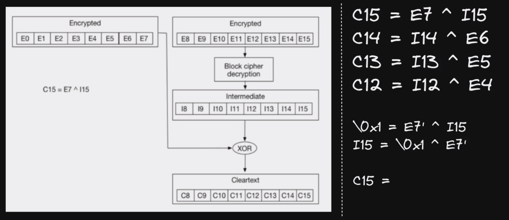

# Enumeraciones


Los siguientes comandos dependen de permisos del servicio IAM


## Enumeración de usuarios

Listado de todos los usuarios.

```bash
aws iam list-users
```

<figure><figcaption></figcaption></figure>


Listado de todos los grupos de un usuario en específico.

```bash
aws iam list-groups-for-user --user-name <Usuario>
```

<figure><figcaption></figcaption></figure>


### Certificados

Información sobre las claves públicas SSH asociadas al usuario específico.

```bash
aws iam list-ssh-public-keys --user-name <Usuario>
```

<figure><figcaption></figcaption></figure>


Comando que devuelve información sobre una llave pública SSH específica asociada al usuario especificado.


```bash
aws iam get-ssh-public-key --user-name <Usuario> -- encoding PEM --ssh-public-key-id <ID-SSH-Key>
```


<figure><figcaption></figcaption></figure>


Comando para ver información sobre los certificados de firma asociados con el usuarios especificado.

```
aws iam list-signing-certificates --user-name <User>
```

<figure><figcaption></figcaption></figure>


### Dispositivos MFA

Listado de los dispositivos MFA(Multi-Factor Authentication) virtuales definidos en la cuenta de AWS

```
aws iam list-virtual-mfa-devices
```

<figure><figcaption></figcaption></figure>


### Políticas del usuario

Listado de políticas adjuntas al usuario

```bash
aws iam list-attached-user-policies --user-name <User>
```

<figure><figcaption></figcaption></figure>


Listado de políticas en formato simple asociadas al usuario // Políticas en línea insertadas (embed to one user)&#x20;

```bash
aws iam list-user-policies --user-name <User>
```

<figure><figcaption></figcaption></figure>


## Enumeración de grupos

Enumera todos los grupos

```bash
aws iam list-groups
```

<figure><figcaption></figcaption></figure>


### Políticas del grupo


Listado de todas las políticas asociadas a un grupo en específico

```
aws iam list-attached-group-policies --group-name <Group>
```

<figure><figcaption></figcaption></figure>


Listado de políticas en formato simple asociadas al grupo // Políticas en línea insertadas (embed to one group)&#x20;

```
aws iam list-group-policies --group-name <Group>
```

<figure><figcaption></figcaption></figure>


## Enumeración de Roles

Listado de todos los roles de IAM

```bash
aws iam list-roles
```

<figure><figcaption></figcaption></figure>


Comando que devuelve información sobre el rol específico

```bash
aws iam get-role --role-name <Rol>
```

<figure><figcaption></figcaption></figure>


### Políticas del rol

Lista todas las políticas gestionadas que se adjuntan al rol

```bash
aws iam list-attached-role-policies --role-name <Rol>
```

<figure><figcaption></figcaption></figure>


Listado de políticas en formato simple asociadas al rol// Políticas en línea insertadas (embed to one rol)&#x20;

```
aws iam list-role-policies --role-name <Rol>
```

<figure><figcaption></figcaption></figure>


## Enumeración de políticas


