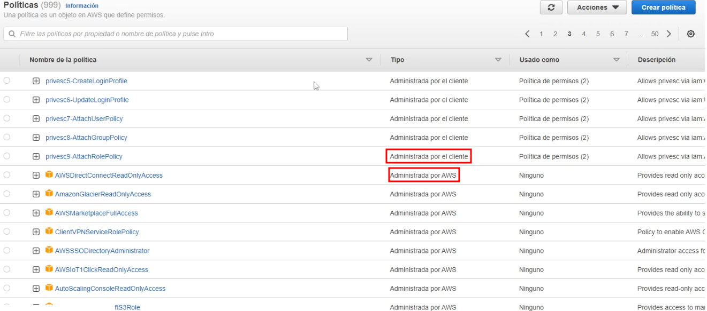

# Políticas de IAM

Se puede administrar el acceso en AWS creando políticas y asignándoselas a identidades de IAM (usuarios, grupos de usuarios o roles) o a recursos de AWS. Una política es un objeto de AWS que, cuando se asocia a una identidad o un recurso, define sus permisos. AWS evalúa estas políticas cuando una entidad principal de IAM (usuario o rol) realiza una solicitud. Los permisos en las políticas determinan si la solicitud se permite o se deniega. La mayoría de las políticas se almacenan en AWS como documentos JSON.

<figure><figcaption>
Política de todos los recursos en todas las acciones de efecto inmediato 
</figcaption></figure>

## Políticas basadas en Identidad

Controlan qué acciones puede realizar la identidad, en qué recursos y en qué condiciones. Las políticas basadas en la identidad pueden clasificarse de la siguiente manera:

### Políticas Administradas

Políticas independientes basadas en la identidad que puede adjuntar a varios usuarios, grupos y funciones en su cuenta de AWS. Puede utilizar dos tipos de políticas administradas:

1. <mark style="color:green;">**Políticas administradas de AWS**</mark> – Políticas administradas creadas y administradas por AWS.
2. <mark style="color:green;">**Políticas administradas por el cliente**</mark> – Políticas administradas que crea y administra en su cuenta de AWS. Las políticas administradas por el cliente ofrecen un control más preciso sobre las políticas que las políticas administradas por AWS.

<figure><figcaption>
Listado de políticas
</figcaption></figure>

### Políticas insertadas

Políticas que crea y administra y que están integradas directamente en un único usuario, grupo o rol

## Políticas basadas en recursos

Son las que controlan qué acciones puede realizar una entidad principal en ese recurso y en qué condiciones. Las políticas basadas en recursos son políticas en línea y no hay políticas administradas basadas en recursos. Para habilitar el acceso entre cuentas, puede especificar toda una cuenta o entidades de IAM de otra cuenta como la entidad principal de una política basada en recursos.

<figure><figcaption></figcaption></figure>

